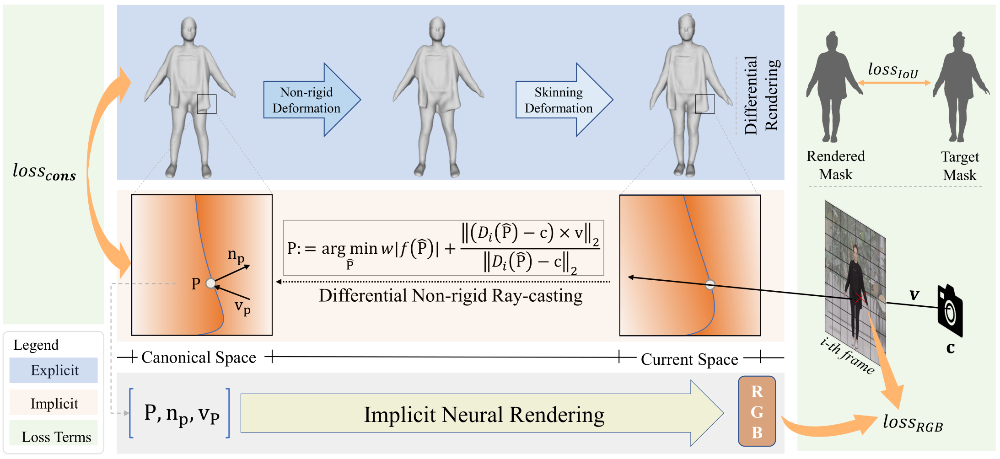
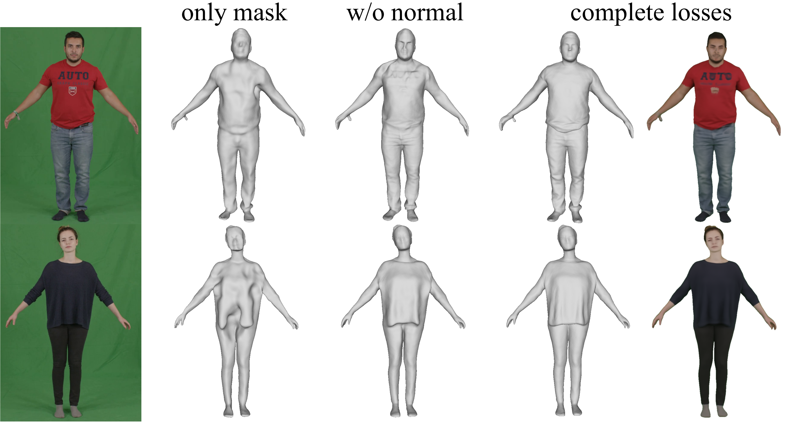

# CVPR 2022 Oral | 一段单目自转视频即可创建你的高保真数字化身，so easy！

<!--  -->

近年来，随着图形技术的快速发展，各类虚拟数字人开始走入我们的日常，如数字航天员小诤、百度智能云AI手语主播、腾讯3D手语数智人“聆语”等纷纷亮相。实际上，三维数字人技术于我们的日常生活早有应用，如早在2015年上映的电影《速度与激情7》中，就曾使用三维数字人技术帮助复活已故演员保罗沃克。

https://user-images.githubusercontent.com/49339865/172138086-a647f41f-baaf-4ca4-9218-e5a0ebd70851.mp4

在去年的GTC大会上，英伟达更是基于高保真虚拟数字人技术举办了一场以假乱真的产品发布会，一时引发广泛关社会关注与讨论。同样地, 英伟达的数字人生成与建模同样也需要高昂的人力成本和高端的硬件支持。据悉，英伟达为保证报告视频中的老黄足够真实，期间调配了34个3D美术师、15个软件研究人员，实现了21个不同版本的假老黄，最终展示给我们的则是从中选择的最为理想的一个。在该版本中，英伟达可以说整合了各种建模、编辑、驱动以及渲染技术，更是借助工业级高规格采集设备来保证重建的三维人体的几何材质精度，在耗时良久的情况下才达到如下所示的难辨真假的视觉效果。

<!-- 近些年，随着计算、通信以及人工智能等技术的发展，真实世界由于其时空限制，已逐渐无法满足人类在工作、生活、娱乐等方面的需求。为此，人们开始尝试打破真实世界的物理边界，进而基于数字技术打造虚拟的数字世界。 -->
<!-- 

 -->
<!--
https://user-images.githubusercontent.com/49339865/171988840-12079742-44bc-4da3-b725-8d834f0c3edf.mp4
 -->
 
<!-- 数字世界作为真实世界的扩展，可以承载人们更多的想象力与创造力。在数字世界中，虚拟数字人将是数字世界的基本生命个体，并在数字世界运行的方方面面扮演着核心角色。同时，虚拟数字人在数字世界的作用也将服务于我们的真实世界，如2021年英伟达就曾基于三维数字人技术举办了一场以假乱真的产品发布会。据悉，为保证报告视频中的老黄足够真实，英伟达调配了34个3D美术师、15个软件研究人员，实现了21个不同版本的假老黄，最终展示给我们的则是从中选择的最为理想的一个。在该版本中，英伟达可以说整合了各种建模、编辑、驱动以及渲染技术，更是借助工业级高规格采集设备来保证重建的三维人体的几何材质精度，在耗时良久的情况下才达到如下所示的难辨真假的视觉效果。
 -->
 
https://user-images.githubusercontent.com/49339865/171988891-8acc57a8-e2a9-4b2e-8dac-4307bd9f9897.mp4

然而，如此高昂的人力成本与时间成本、以及技术上的复杂性和专业性要求不可避免地导致相关方法难以推广至一般消费市场。另一方面，随着移动端手机设备的普及，单目RGB数据开始变得唾手可得，因此若**仅仅依靠单目RGB视频数据就能高效便捷地获取普通对象的高质量可驱动数字化身**，将切实地推动虚拟数字人及其相关技术应用与发展，而这也是三维视觉以及图形学领域一直致力于的研究目标。

---
为此，中科大[张举勇教授](http://staff.ustc.edu.cn/~juyong/)课题组联合[杭州像衍科技有限公司](https://idr.ai/)与浙江大学，于近期一同提出**一种基于单目RGB视频的高保真三维人体重建算法——SelfRecon**，该算法仅需输入目标对象一段十几秒的自转视频，即可恢复重建对象的高保真数字化身。该研究工作已被CVPR 2022接收，并将于CVPR会议期间进行口头报告。

- 论文链接: https://arxiv.org/abs/2201.12792
- 项目主页: https://jby1993.github.io/SelfRecon/
- 代码链接: https://github.com/jby1993/SelfReconCode 

      
    <em>基于SelfRecon生成的纹理模型</em>

SelfRecon的重建效果如下所示。基于普通智能手机拍摄的自转视频，SelfRecon可准确跟踪三维动态几何，并有效还原宽松衣服的动态效果。得益于输入的简易性，基于SelfRecon将有望大幅度降低人们获取个人高保真数字化身的成本与难度。

https://user-images.githubusercontent.com/14065422/172185389-d073403d-346c-4bb8-b0f0-849a73a96f32.mp4

    <em>SelfRecon: 重建展示</em>

 

SelfRecon的算法流程如下所示，SelfRecon创新地整合了三维显式表示与三维隐式表示，并利用神经可微渲染来自动化地构建目标对象的三维数字表示。具体地，SelfRecon一方面使用基于MLP的隐式函数来表示基准空间的符号距离场。同时，在优化该MLP网络参数的过程中，SelfRecon会周期性地从隐式表示的符号距离场中提取显式网格，接着SelfRecon会利用该显式表示相关的可微遮罩Loss来保证显式网格能够维持和真值相近的几何形状。另一方面，SelfRecon精巧地设计了一种非刚性射线投射算法来求解射线与隐式基准表面的精准交点。进一步地，SelfRecon利用隐式神经渲染以及交点处的相关信息来生成该射线的渲染颜色，并将渲染结果与采集到的颜色真值进行比对，从而自监督地逐渐优化出目标对象的隐式几何表示。在该过程中，SelfRecon也提出并应用匹配损失来保证三维显式表示与隐式表示的一致性，进而有效提升优化过程的鲁棒性。

      
    <em>SelfRecon的算法流程图</em>

如下所示，SelfRecon通过前向变形来建立基准帧与当前帧的联系。首先，SelfRecon会通过另一个隐式神经网络来建模人体运动带动的衣物的非刚性变形。接着，SelfRecon会使用预生成的蒙皮变形场和当前帧的人体Pose信息对目标人体进行铰链变形。

https://user-images.githubusercontent.com/14065422/171910826-44b1afc0-4b34-487b-bf70-6b7ca87134f0.mp4

    <em>SelfRecon: 前向变形图</em>

 

在计算射线和隐式基准曲面交点的过程中，SelfRecon首先计算射线与当前帧显式网格的交点，接着SelfRecon利用当前帧显式网格和基准显式网格的拓扑一致性来获得该交点在基准显式网格上的对应点。同时，由于显式网格理论上是隐式曲面的分片线性估计，因此该交点应接近于射线与隐式曲面的准确交点。基于此，SelfRecon将射线与基准显式网格的交点作为射线与基准隐式表示交点的初值，并迭代求解相关能量来快速生成射线和基准隐式曲面的准确交点P。此外，SelfRecon通过推导隐式表示关于P的隐式微分公式来生成P关于各优化变量的一阶导数，进而使得整个渲染过程可以有效反向传播梯度，并端到端地优化整个渲染过程。相关过程如下所示：

https://user-images.githubusercontent.com/14065422/172185109-89ebe421-616d-4555-a7bd-5f90fc0f5a27.mp4

    <em>SelfRecon: 可微非刚性射线投射</em>

 

下图展示了SelfRecon各个损失能量项的有效性。如下所示，虽然仅使用遮罩损失也能够恢复整体的人体形状，但相关结果并无法重建目标对象正确的凹凸形状。而在添加使用了神经渲染损失之后，可以发现重建结果得到明显改进，这也证明了颜色信息的重要作用。进一步，SelfRecon也支持利用预测的法向对优化过程进行额外监督，从而进一步提高SelfRecon的重建质量。

      
    <em>SelfRecon各损失的作用</em>

下图展示了SelfRecon与当前最优方法的定性对比。如下所示，SelfRecon获得了state-of-the-art的重建效果。效果上，SelfRecon可以对宽松衣物进行准确建模，在得到光滑曲面的同时，还能较好地恢复一些几何细节，包括衣物的褶皱，手指和面部特征等。

      
    <em>SelfRecon与其他方法的比较</em>

另外，SelfRecon的重建结果天然地支持高清纹理提取和姿态驱动，以下视频展示了相关驱动效果。

https://user-images.githubusercontent.com/14065422/171916395-6889d2dc-e30a-44f0-b38b-176c9d822f40.mp4

关于SelfRecon的更多算法细节与实验结果，请参考[项目主页](https://jby1993.github.io/SelfRecon/)与[论文](https://arxiv.org/abs/2201.12792)。若想了解更多数字人的便捷建模与真实应用，请参考[杭州像衍科技有限公司](https://idr.ai/)。
