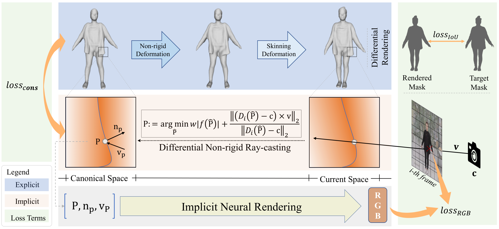
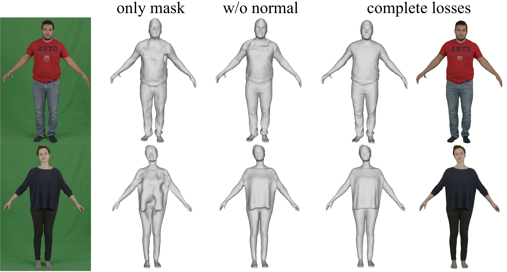

# 中科大提出高保真人头参数化模型HeadNeRF，可创建与编辑高保真数字人

虚拟数字人，指在计算机中，运用图形学、渲染、动作捕捉、深度学习、语音合成等众多技术手段创造及使用，并具有包括外貌特征、表演能力、交互能力等在内的众多人类特征的综合产物。

近年来，随着虚拟技术的发展，各种数字人层出不穷。在刚过去的北京冬奥会上，体育明星谷爱凌的数智分身“Meet Gu”、 百度智能云AI手语主播、腾讯3D手语数智人“聆语”等纷纷亮相。这些数字人的出现让大众直观地认识到了这一新兴事物。

      
    <em></em>

在此之前，美妆达人柳夜熙，数字航天员小诤等，虚拟数字人Siren等都以各种身份渗透到人们的生活中。其中柳夜熙更是收获超800万粉丝，成为2021年现象级虚拟数字人。

      
    <em>数字航天员小诤</em>

数字人的飞速发展，不禁让笔者联想到斯皮尔伯格的《头号玩家》，一套VR设备，便可以将一位普通人拉入到寄托人类救赎的虚拟世界——Oaisis，开始另一段元宇宙中的人生旅途。然而，现在的技术真的已经能够为普通人快速地构建虚拟数字人了吗？

腾讯游戏旗下NExT Studios曾透露，要制作Siren这样的数字人，需要使用lightstage等工业级的采集系统，几个工作室在数月之中紧密合作，耗费相当的人力和时间成本。可以想象，当人类都可以像《头号玩家》中一样，人人皆有自己的数字化身，所需创建的虚拟角色体量应该是空前庞大的。如果还依靠传统的工业级流水线，所需要的成本必然是不可承受的。因而，能够使用便携的设备，例如智能手机，即可方便自动地为普通人构建数字化身，成了一个值得研究的问题。

---

基于上述观察，中科大张举勇教授课题组提出了SelfRecon，一种基于单目视频的重建算法，能够从一段十几秒的自转视频恢复高保真的穿衣人物几何，并生成高质量的数字化身。
- 文章链接: https://arxiv.org/abs/2201.12792
- 项目主页: https://jby1993.github.io/SelfRecon/
- 代码链接: https://github.com/jby1993/SelfReconCode 

      
    <em>基于SelfRecon生成的纹理模型</em>

重建效果上，SelfRecon基于隐式神经表示和神经渲染，可以为穿着各式衣物的人重建出空时一致的网格序列，并能够准确恢复宽松衣物的动态。相关重建效果如下视频所示。

https://user-images.githubusercontent.com/14065422/171916128-5d391cc3-9c18-4155-b877-69612308a472.mp4

    <em>SelfRecon: 重建展示</em>

 

当前的人体重建算法，从几何表示形式上大致可以分为显式和隐式表示两种。显式表示就是传统的网格模型，能够很好地兼容成熟的图形学管线。其依赖于参数化人体表示来表达人物几何或者使用预先生成的对应人物的模板网格来辅助跟踪。因而其结果受限于固定的拓扑，要么难以建模宽松衣物的动态，要么无法扩展到不同的穿衣人物。在最近的多层感知机兴起之后，神经隐式表示被广泛地应用于重建任务。其可以表达更灵活的拓扑并具有更强的重建能力。然而，隐式表示难以整合整个序列生成空时一致的网格表示，方便下游的应用。SelfRecon的动机在于，结合显式和隐式表示的优势，能够为任意人物方便地进行高保真重建，同时整合序列信息生成一致的网格序列。SelfRecon的算法流程图如下所示：

      
    <em>SelfRecon的算法流程图</em>

SelfRecon使用一个多层感知机网络f来表示基准空间的符号距离场。在优化过程中，显式网格会周期性地重新提取来确保和隐式表示的一致性和对拓扑变化的建模。为了整个序列生成空时一致的表示，SelfRecon使用前向变形场将基准几何变形到当前帧空间。同时，可微的遮罩损失作用在显式网格上以维持住整个几何大致的人物形状。为了改进曲面细节，SelfRecon提出了一种非刚性射线投射算法，能够计算出相机发出射线与隐式曲面可微的精准交点，然后基于交点处的相关信息，利用渲染网络得到恢复的颜色，并与真实值进行比对，从而达到改进曲面细节的目的。同时，如果提供了预测的法向信息，也可以进一步监督隐式曲面的优化。 最后，SelfRecon还设计了一个匹配损失来保持显式和隐式表示的一致性，使得优化过程能够稳定地进行。

如下所示，SelfRecon的前向变形场分为两部分，第一部分主要建模由人体运动带动的衣物的非刚性变形，能够较精准地建模宽松衣物的形变。第二部分使用预计算的蒙皮变形场和每帧的人物铰链姿态来表达人体的运动。

https://user-images.githubusercontent.com/14065422/171910826-44b1afc0-4b34-487b-bf70-6b7ca87134f0.mp4

    <em>SelfRecon: 前向变形图</em>

 

如下所示，在计算射线和隐式曲面的交点的时候，SelfRecon首先考虑从相机发出的一条射线与显式网格的交点，然后利用显式网格的一致拓扑性，使用重心坐标获得该点在基准网格上的对应点。由于显式网格是隐式曲面的分片线性估计，该交点应接近于跟隐式曲面的准确交点P。利用显式网格的交点作为P的初值，迭代求解一个优化能量就能快速得到射线和隐式曲面的准确交点。然后，利用隐式微分公式，即可得到P关于各优化变量的求导，使得整个优化可以端到端地进行。

https://user-images.githubusercontent.com/14065422/171910904-39421795-5175-41f3-93eb-4a54f6ff9e3d.mp4

    <em>SelfRecon: 可微非刚性射线投射</em>

 

SelfRecon依赖于单目视频进行自监督的重建，在实验中发现，单纯地使用遮罩损失，虽然能够恢复整体的人形，但是无法正确估计曲面的凹凸属性。使用了神经渲染损失之后，结果得到明显改进，证明了颜色信息的重要作用。进一步，利用一些预训练的法向预测网络为视频预测对应的法向，并利用该法向进行弱监督，可以有效地提高重建质量，尽管网络预测的法向可能带有大量的噪音。

      
    <em>SelfRecon各损失的作用</em>

SelfRecon跟一些基于显式或隐式表示的方法的比较。总体来说，SelfRecon可以对宽松衣物进行准确的建模，在得到光滑曲面的同时，还能较好地恢复一些几何细节，包括衣物的褶皱，手指和面部特征等。

      
    <em>SelfRecon与其他方法的比较</em>

另外，基于SelfRecon的重建，可以提取高质量的纹理avatar，进而可以进行驱动等有趣的应用。

https://user-images.githubusercontent.com/14065422/171916395-6889d2dc-e30a-44f0-b38b-176c9d822f40.mp4

更多结果和介绍，请参考SelfRecon的[项目主页](https://jby1993.github.io/SelfRecon/)与[文章](https://arxiv.org/abs/2201.12792)。

我们相信，基于便携式设备为普通人方便地制作高质量数字化身，在不远的将来，将慢慢地变为现实。
